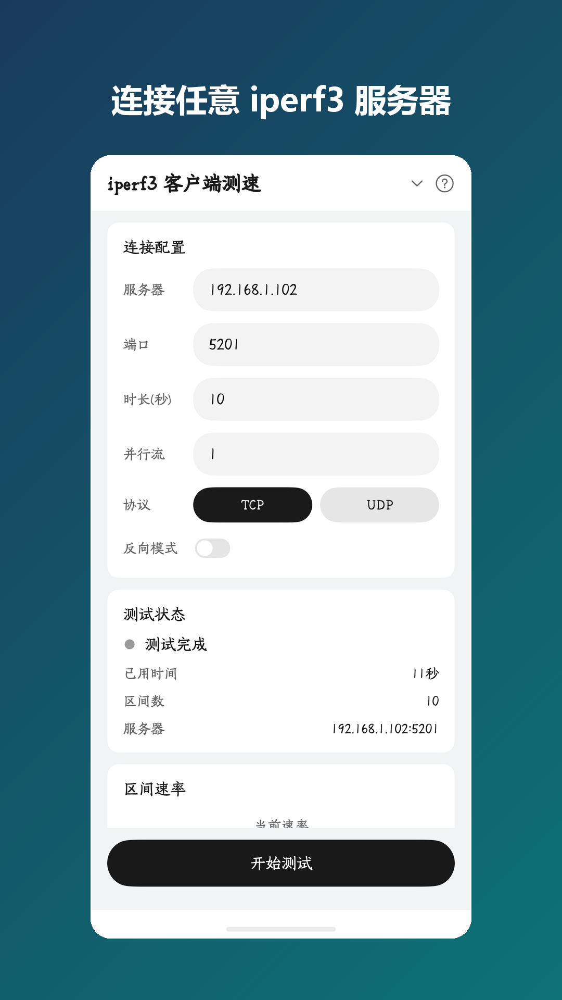
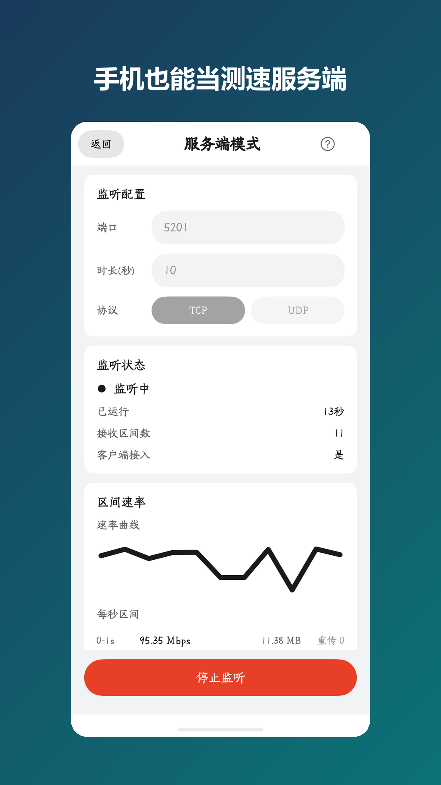
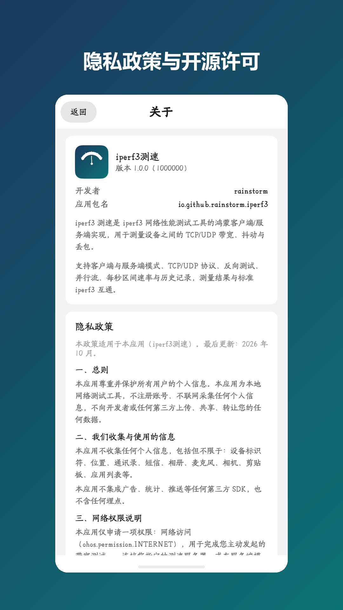

# iperf3 测速 · HarmonyOS

iperf3 网络性能测试工具的 **HarmonyOS 原生实现**（客户端 + 服务端），基于上游 libiperf 3.22，
通过 NAPI 桥接层在 ArkTS 应用中使用。测量口径与标准 iperf3 一致，可直接与桌面端
iperf3 服务端/客户端互测。

> 应用名：`iperf3测速`　包名：`io.github.rainstorm.iperf3`

## 功能

| 功能 | 说明 |
| --- | --- |
| 客户端模式 | 连接任意标准 iperf3 服务端（默认端口 5201），测量上/下行带宽 |
| 服务端模式 | 手机作为 iperf3 服务端监听端口，供电脑或其他设备连接测速 |
| TCP / UDP | TCP 测可靠带宽与重传次数；UDP 测抖动与丢包率 |
| 反向模式 | 服务端发、客户端收（等价 `iperf3 -R`），测下行带宽 |
| 并行流 | 1~128 条并发连接，测聚合带宽 |
| 高级选项 | 自定义 TCP 滑动窗口与读写分块大小 |
| 实时展示 | 当前速率大数字 + 自绘速率曲线 + 每秒区间明细（传输量/重传/抖动/丢包） |
| 历史记录 | 测试结果自动写入本地关系型数据库，支持详情、删除、清空 |
| 合规 | 应用内提供隐私政策与开源许可全文；仅申请网络权限，不收集个人信息 |

## 截图

| 客户端测速 | 服务端模式 | 隐私政策与开源许可 |
| --- | --- | --- |
|  |  |  |

## 技术架构

```
ArkTS 界面层（entry/src/main/ets）
        │  NAPI 契约：start / stop / onInterval / onFinish / onError
        ▼
NAPI 桥接层（entry/src/main/cpp，C/C++）
        │  直接调用 libiperf API
        ▼
上游原生库（third_party/iperf，libiperf 3.22，BSD-3，未做功能性修改）
```

- **线程模型**：测试在独立线程执行，区间与汇总结果经 `napi_threadsafe_function` 回传
  ArkTS 线程，界面刷新与网络执行互不阻塞
- **取消能力**：`cpp/patch/iperf_cancel.h` 以补丁方式提供跨线程中断，不改动上游源码，
  停止后完整回收线程与资源
- **失败回滚**：引擎启动时线程创建失败会回滚运行状态并上报错误，避免卡在"已运行"
- **折线图**：自绘 `Path`，坐标按控件实测像素尺寸生成（`Path` 坐标单位是 px，
  与布局的 vp 不同），随屏幕密度自适应；纵轴按数据区间自适应

主要文件：

| 路径 | 职责 |
| --- | --- |
| `entry/src/main/cpp/iperf_bridge.{h,cpp}` | NAPI 桥接层：参数解析、libiperf 调度、区间/汇总解析、回调 |
| `entry/src/main/cpp/napi_init.cpp` | NAPI 模块注册与 5 个导出函数 |
| `entry/src/main/cpp/patch/iperf_cancel.h` | 跨线程取消补丁 |
| `entry/src/main/ets/common/NativeIperf.ets` | 契约类型与 native 适配（唯一访问原生库的入口） |
| `entry/src/main/ets/pages/{Index,Server,History,About}.ets` | 四个页面 |
| `entry/src/main/ets/common/{SharedComponents,RateChart,HelpSheet,DesignTokens,Licenses}.ets` | 公共组件与设计令牌 |
| `entry/src/main/ets/utils/{Format,HistoryDb}.ets` | 格式化与本地存储 |
| `third_party/iperf/` | 上游 libiperf 源码（含 `LICENSE`） |

## 构建

需要 DevEco Studio（本工程在 **DevEco Studio 26.0.0 + HarmonyOS SDK API 26** 下验证通过，
`compatibleSdkVersion` 为 `5.0.0(12)`）。

**方式一：DevEco Studio**

用 DevEco Studio 打开工程目录，`Build > Build Hap(s)/APP(s) > Build Hap(s)`。

**方式二：命令行**

```bash
export JAVA_HOME="<DevEco>/jbr"
export DEVECO_SDK_HOME="<DevEco>/sdk"
"<DevEco>/tools/node/node.exe" "<DevEco>/tools/hvigor/bin/hvigorw.js" \
    assembleHap --mode module -p product=default
```

产物：`entry/build/default/outputs/default/entry-default-unsigned.hap`

首次构建会编译原生库（CMake/Clang，NDK 随 DevEco 安装）；原生源码在
`entry/src/main/cpp`，`third_party/iperf` 为上游源码，未改动。

## 安装与签名

- **自用/调试（最简单）**：克隆工程后用 DevEco Studio 打开，配置自动签名
  （`File > Project Structure > Signing Configs`）直接运行到设备
- **不想编译**：从 [Releases](../../releases) 下载未签名包
  `iperf3-harmony-1.0.0-unsigned.hap`，按
  [`docs/RELEASE-BUILD.md`](docs/RELEASE-BUILD.md) 用自己的证书签名后安装
- **发布**：需要自备 AppGallery Connect 的发布证书与 Profile，用 SDK 自带 `hap-sign-tool`
  对 HAP 与 APP 分别签名；步骤见 [`docs/RELEASE-BUILD.md`](docs/RELEASE-BUILD.md)

> 注意：**发布签名的包无法通过 hdc 侧载安装**（设备只信任调试证书或应用商店来源），
> 这是 HarmonyOS 的既有机制，不是包的问题。

## 许可

- 本工程代码：**BSD-3-Clause**，见 [`LICENSE`](LICENSE)
- 内置的 iperf3（libiperf）：BSD-3-Clause（LBNL 变体）及若干组件许可，
  全文见 [`third_party/iperf/LICENSE`](third_party/iperf/LICENSE)，并在应用内
  「关于 → 开源许可」中完整展示

## 免责声明

本工具用于合法的网络性能测试。请仅对你拥有或已获明确授权的网络与设备进行测试；
对使用本软件造成的任何后果，作者不承担任何责任。本软件按"现状"提供，不附带任何明示或暗示的担保。

## English

A native HarmonyOS client/server implementation of the iperf3 network performance test tool,
built on upstream libiperf 3.22 and exposed to ArkTS through a NAPI bridge. It interoperates
with standard iperf3 servers and clients, supports TCP/UDP, reverse mode, parallel streams,
real-time rate chart with per-second intervals, and local history storage.

Build with DevEco Studio (validated with 26.0.0 / HarmonyOS SDK API 26) or via
`hvigorw assembleHap`. Release signing requires your own AppGallery Connect release
certificate and profile — see [`docs/RELEASE-BUILD.md`](docs/RELEASE-BUILD.md).

Licensed under BSD-3-Clause; bundled iperf3 retains its own BSD-3-Clause (LBNL variant) license.
